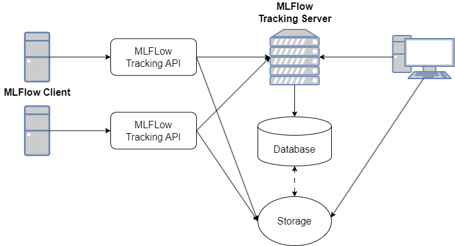

# はじめに

## MLFlowとは？

MLflowは機械学習のライフサイクルを管理するためのオープンソースプラットフォームである。
このプラットフォームは主に以下の4つのコンポーネントから成り立っている。

* MLflow Tracking: 機械学習における実験管理
* MLflow Projects: 機械学習コードの再現可能な保存・パッケージング
* MLflow Models: 機械学習モデルのデプロイメントの容易化
* MLflow Model Registry: 機械学習モデルのバージョン管理とライフサイクル管理

## 機械学習における実験管理とは？

機械学習における実験管理は、モデルの開発と最適化のプロセスを体系的に記録、追跡、および分析することを目的として行うものである。

### 実験管理ツールに求められる機能要件

実験管理ツールとして求められる機能要件は以下の通りである。

* **パラメータの記録**  
  ハイパーパラメータ、データセットの設定、前処理手順など、実験に使用されるパラメータを記録し、パラメータの変更が結果にどのように影響するかを追跡することができる。
* **メトリクスの記録**  
  実験の評価指標（accuracy、precision、recall、F1 Scoreなど）を記録し、実験の進行状況とパフォーマンスを監視することができる。
* **アーティファクトの保存**  
  モデルファイル、データセット、グラフ、ログファイルなどの実験関連のアーティファクト（成果物）を保存し、実験の再現に必要な資産を一元管理することができる。
* **実験の比較と可視化**  
  記録された実験結果を比較し、パラメータとメトリクスの関係を分析することにより、グラフやチャートを使って実験結果を可視化し、パフォーマンスの傾向を把握できるようになる。
* **コラボレーション**  
  チームメンバー間で実験結果を共有し、コラボレーションを促進する。
* **バージョン管理**  
  実験のバージョン管理を行い、実験の再現性を確保する。

実験管理ツールのプロダクトであるMLFlow Trackingは、ここで示された機能要件を満たすツールである。


### 実験管理によるメリット

実験管理を適切に行うことで、以下のようなメリットがある。

* **実験の再現性**  
  実験に使用されたパラメータ、データ、モデルなどを記録することで、実験を再現しやすくなります。
* **実験の最適化**  
  パラメータとメトリクスの関係を分析することで、最適なモデルやハイパーパラメータを見つけやすくなります。
* **知見の蓄積**  
  実験結果を蓄積することで、機械学習プロジェクトから得られる知見を組織内で共有し、活用できます。
* **時間の節約**  
  実験管理ツールを使用することで、手動での記録や管理にかかる時間を削減できます。

MLFlow Trackingのような実験管理ツールを活用することで、機械学習プロジェクトの効率化と、再現性の向上、チームコラボレーションの促進が期待できます。


## MLFlow Trackingについて

### システム構成

MLFlow Trackingは、MLFlow Tracking APIを介して、以下の通り実験の結果を保存する。

* Storageに対して、アーティファクトが保存される。
* Databaseに対して、MLFlow Tracking Serverを経由して、パラメータやメトリクスの記録が行われる。
  また、アーティファクトの保存先はDatabaseに記録される。

MLFlow Tracking Server（以下「Tracking Server」と表記する）には、Web UIが存在する。そのUIから、実験の結果の閲覧やアーティファクトのダウンロードができる。  
なお、アーティファクトはStorageに対して直接アクセスし、ダウンロードすることも可能である。




### コンポーネント構成

実運用という観点では、上記のコンポーネントに対し、以下の条件により稼働することが推奨される。

* Tracking Server: 実験しているサーバ(MLFlow Client)からは切り離されたマシンに構築することが推奨される。
* Database: RDB(MySQL, PostgreSQL, SQLite etc)に構築することが推奨される。ローカルディスク上への構築も可能ではある。
* Storage: MLFlow Serverのローカルディスク、NAS、オブジェクトストレージ(Amazon S3 etc)などを指定することができる。

なお、機能検証など、可用性の考慮が不要な状況であれば、コンポーネントのすべてを1台のローカルマシンに保持することが可能であり、Databaseもローカルマシンのディスクを指定することで、RDBのセットアップをせずに用いることも可能である。

今回は機能検証を目的とすることから、すべてのコンポーネントをローカルマシンにセットアップする。


## 環境のセットアップ

### ステップ1: MLFlowのインストール

MLFlowはPyPI経由でインストール可能である。
もしまだシステムにインストールされていない場合、pipでインストールを行う。

```Bash
pip install mlflow
```

### ステップ2: Tracking Serverの起動

Tracking Serverの起動を行う。  
`--host`により、アクセスを許可するIP（`0.0.0.0`を指定すると任意のIPから接続可能になる）、`--port`により、アクセスのために許可するポート番号を指定する。  

```Bash
mlflow server --host 0.0.0.0 --port 5000
```

※今回は検証のため、アーティファクトの保存先はTracking Serverのローカルであることから、それに関するパラメータ指定は行っていない。


### ステップ3: Tracking Server URIの設定と実験の実行

実験の実行を行う。

その実験の結果を記録するため、事前にTracking Serverへアクセスするための設定を行う必要がある。
その設定は以下をPythonのコードとして記述する必要がある。

```Python
import mlflow

mlflow.set_tracking_uri(uri="http://<HOST>:<PORT>")
```

`<HOST>`はTracking ServerのIPアドレス（今回は`localhost`あるいは`127.0.0.1`）、`<PORT>`はアクセスが許可されたポート番号（今回は`5000`）を指定する。

設定を行うことで、記録する準備が完了となる。  
以降はNotebookをもとに、どのように実験の記録がなされるかを確認していく。

