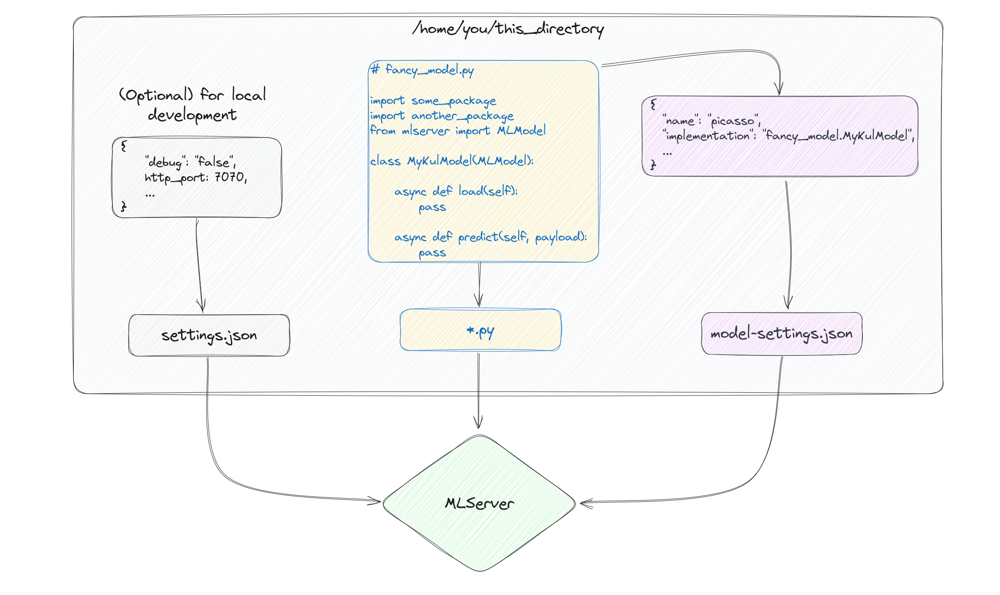
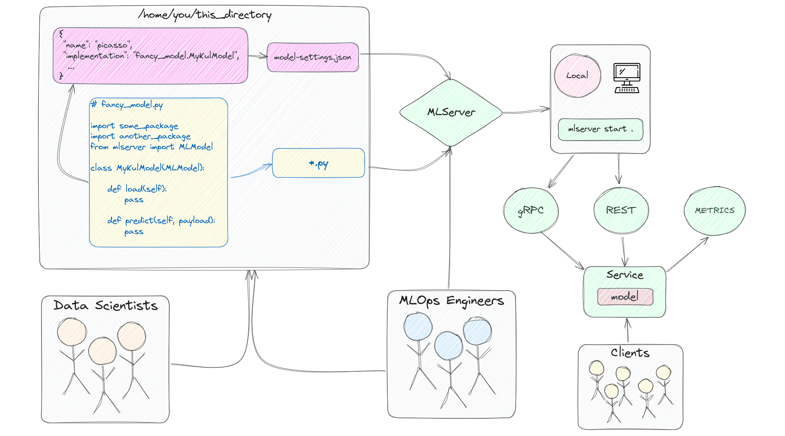

# MLServer チュートリアル

MLServerについて、[言語モデル](https://spacy.io/models/en#en_core_web_lg) `spacy`をベースに、MLServerの使い方を学ぶ。

同じ端末上での操作になるが、サーバ側のターミナルとクライアント側のターミナルの2つのターミナルから操作する。


## 00 MLServerとは？

MLServerは、機械学習モデルのための本番環境向けの非同期APIを構築するためのオープンソースのPythonライブラリです。


## 01 環境構築

まずは環境構築を行うため、サーバ側のターミナルを用いる。

### Pythonライブラリのインストール

最初にこのチュートリアルを実行するにあたって必要となるライブラリを以下の通り導入する。

```
pip install mlserver spacy wikipedia-api
```

なお、`requests`のバージョンに依存したエラーが発生したことから、アップグレードも同時に行った。

```
pip install -U requests
```

`mlserver`、`spacy`ライブラリ、および私たちのユースケースに必要な[言語モデル](https://spacy.io/models/en#en_core_web_lg) `spacy`をインストールすることです。また、いくつかの楽しい要約で私たちのユースケースをテストするために`wikipedia-api`ライブラリもダウンロードします。

もし[spaCy](https://spacy.io/)を聞いたことがなければ、それは大規模な情報抽出や検索タスクなどに優れた、高度な自然言語処理を行うオープンソースのPythonライブラリです。ここで使用するモデルは、ウェブ上の英語テキストから事前に訓練されたモデルです。このモデルは、私たちのユースケースをゼロからモデルを訓練するよりも迅速に始めるのに役立ちます。


### 言語モデルの取得

また、仮想環境内にspaCyをインストールした後、言語モデルを別途ダウンロードする必要があります。

```
python -m spacy download en_core_web_lg
```

このガイドをノートブック内で確認している場合、上記の2つのコマンドの前に感嘆符`!`を忘れずに追加してください。VSCodeを使用している場合は、そのままにしてセルのタイプをbashに変更できます。


### モデル化するものの確認

2つのドキュメント間の類似性を比較するサービスを作成する前に、特に事前に訓練されたモデルやパイプラインを使用している場合、最初に私たちのソリューションが機能するかどうかをテストすることが良い習慣です。

ここではPython REPLより確認する。

```
python
```

Python REPLが起動したら、以下の通り、モデルのロードを行う。

```python
# Python REPL
import spacy
nlp = spacy.load("en_core_web_lg")
```

モデルをロードしたら、`wikipedia-api` Pythonライブラリを使用して、[Barbieheimer](https://en.wikipedia.org/wiki/Barbenheimer)の要約の類似性を調べます。

このAPIを使用するための主要な要件は、`Wikipedia()`クラスにプロジェクト名、メールアドレス、および情報を取得したい言語を渡すことです。

```python
# Python REPL
import wikipediaapi
wiki_wiki = wikipediaapi.Wikipedia('MyMovieEval (example@example.com)', 'en')
```

その後、`.page()`メソッドに映画のタイトルを渡して、その要約にアクセスできます。

```python
# Python REPL
barbie = wiki_wiki.page('Barbie_(film)').summary
print(barbie)
```
```
Barbie is a 2023 American fantasy comedy film directed by Greta Gerwig and written by Gerwig and Noah Baumbach. Based on the Barbie fashion dolls by Mattel, it is the first live-action Barbie film after numerous computer-animated direct-to-video and streaming television films. The film stars Margot Robbie as Barbie and Ryan Gosling as Ken, and follows the two on a journey of self-discovery following an existential crisis. The film also features an ensemble cast that includes America Ferrera, Kate McKinnon, Issa Rae, Rhea Perlman, and Will Ferrell...
```

```python
# Python REPL
oppenheimer = wiki_wiki.page('Oppenheimer_(film)').summary
print(oppenheimer)
```
```
Oppenheimer is a 2023 biographical thriller film written and directed by Christopher Nolan. Based on the 2005 biography American Prometheus by Kai Bird and Martin J. Sherwin, the film chronicles the life of J. Robert Oppenheimer, a theoretical physicist who was pivotal in developing the first nuclear weapons as part of the Manhattan Project, and thereby ushering in the Atomic Age. Cillian Murphy stars as Oppenheimer, with Emily Blunt as Oppenheimer's wife Katherine "Kitty" Oppenheimer; Matt Damon as General Leslie Groves, director of the Manhattan Project; and Robert Downey Jr. as Lewis Strauss, a senior member of the United States Atomic Energy Commission. The ensemble supporting cast includes Florence Pugh, Josh Hartnett, Casey Affleck, Rami Malek, Gary Oldman and Kenneth Branagh...
```

これで2つの要約が手に入りましたので、spacyを使用してそれらを比較しましょう。

```python
# Python REPL
doc1 = nlp(barbie)
doc2 = nlp(oppenheimer)
doc1.similarity(doc2)
```

以下のような結果が出力されます（細かい値は状況により異なる点に注意）

```
0.9866910567224084
```


<!--
Notice that both summaries have information about the other movie, about "films" in general, 
and about the dates each aired on (which is the same). The reality is that, the model hasn't seen 
any of these movies so it might be generalizing to the context of each article, "movies," 
rather than their content, "dolls as humans and the atomic bomb."

You should, of course, play around with different pages and see if what you get back is coherent with 
what you would expect.

Time to create a machine learning API for our use-case. 😎
-->

両方の要約には、もう一つの映画に関する情報、一般的な「映画」についての情報、そしてそれぞれが放映された日付（同じ日付です）についての情報が含まれています。現実は、モデルはこれらの映画を見たことがないため、各記事のコンテキスト「映画」に一般化している可能性がありますが、その内容"dolls as humans and the atomic bomb."ではないかもしれません。

もちろん、異なるページで遊んでみて、返ってくる結果があなたの期待と一致しているかどうかを確認してください。

私たちのユースケースのための機械学習APIを作成する時が来ました。😎

サーバ側のPython REPLを抜ける。

```python
# Python REPL
quit()
```


## 02 設定

MLServerを使用するためには、基本的に3種類のファイルが必要です。

* `model-settings.json`: モデルに関する情報が記載されているファイル
* `settings.json`: 設定するサーバーに関連する情報を含むファイル（オプション）
* `.py`: モデルのロードと予測のレシピを記述したファイル




モデルのディレクトリを作成する。

```bash
mkdir -p similarity_model
```

<!--
## 03 Building a Service

MLServer allows us to wrap machine learning models into APIs and build microservices with 
replicas of a single model, or different models all together.

To create a service with MLServer, we will define a class with two asynchronous functions, one that 
loads the model and another one to run inference (or predict) with. The former will load the 
`spacy` model we tested in the last section, and the latter will take in a list with the two 
documents we want to compare. Lastly, our function will return a `numpy` array with a single 
value, our similarity score. We'll write the file to our `similarity_model` directory and call 
it `my_model.py`. 
-->

## 03 サービスの構築

### サーバ側の設定

MLServerを使用すると、機械学習モデルをAPIにラップしてマイクロサービスを構築し、単一のモデルのレプリカや異なるモデルを組み合わせることができます。

MLServerでサービスを作成するために、モデルをロードする非同期関数と推論（または予測）を実行するもう一つの非同期関数を持つクラスを定義します。前者は前のセクションでテストした`spacy`モデルをロードし、後者は比較したい2つのドキュメントのリストを受け取ります。最後に、この関数は類似度スコアとして単一の値を持つ`numpy`配列を返します。このファイルを`similarity_model`ディレクトリに書き込み、`my_model.py`と呼びます。


```python
# similarity_model/my_model.py

from mlserver.codecs import decode_args
from mlserver import MLModel
from typing import List
import numpy as np
import spacy

class MyKulModel(MLModel):

    async def load(self):
        self.model = spacy.load("en_core_web_lg")
    
    @decode_args
    async def predict(self, docs: List[str]) -> np.ndarray:

        doc1 = self.model(docs[0])
        doc2 = self.model(docs[1])

        return np.array(doc1.similarity(doc2))
```

<!--
Now that we have our model file ready to go, the last piece of the puzzle is to tell MLServer a bit of info 
about it. In particular, it wants (or needs) to know the name of the model and how to implement 
it. The former can be anything you want (and it will be part of the URL of your API), and the latter will 
follow the recipe of `name_of_py_file_with_your_model.class_with_your_model`.

Let's create the `model-settings.json` file MLServer is expecting inside our `similarity_model` directory 
and add the name and the implementation of our model to it.
-->

モデルファイルの準備が整ったので、残りのピースはMLServerにモデルについて少し情報を教えることです。特に、モデルの名前と実装方法を知りたがっています。前者はあなたが望むもので何でもよく（APIのURLの一部になります）、後者は`name_of_py_file_with_your_model.class_with_your_model`のレシピに従います。

`similarity_model`ディレクトリ内にMLServerが期待する`model-settings.json`ファイルを作成し、そこにモデルの名前と実装を追加しましょう。

```json
# similarity_model/model-settings.json

{
    "name": "doc-sim-model",
    "implementation": "my_model.MyKulModel"
}
```

<!--
Now that everything is in place, we can start serving predictions locally to test how things would play 
out for our future users. We'll initiate our server via the command line, and later on we'll see how to 
do the same via Python files. Here's where we are at right now in the process of developing microservices 
with MLServer.

. 
To learn more about gRPC, please see this tutorial [here](https://realpython.com/python-microservices-grpc/).

To start our service, open up a terminal and run the following command.
-->

全てが整いましたので、将来のユーザーにとってどのような結果が出るかをテストするために、ローカルで予測を提供し始めることができます。サーバーはコマンドラインを通じて初期化され、後にPythonファイルを使用して同様のことを行う方法を見ていきます。現在、MLServerを使用したマイクロサービスの開発プロセスは以下のところまで進んでいます。



画像で見ることができるように、私たちのサーバーはHTTPリクエスト用、gRPC用、およびメトリクス用の3つのエントリポイントで初期化されます。MLServerの強力なメトリクス機能について詳しく知りたい場合は、関連するドキュメントページ[こちら](https://mlserver.readthedocs.io/en/latest/user-guide/metrics.html)をご覧ください。gRPCについて詳しく知るには、このチュートリアル[こちら](https://realpython.com/python-microservices-grpc/)をご覧ください。

サービスを開始するには、ターミナルを開いて次のコマンドを実行してください。


```bash
mlserver start similarity_model/
```

<!--
Note: If this is a fresh terminal, make sure you activate your environment before you run the command above. 
If you run the command above from your notebook (e.g. `!mlserver start similarity_model/`), 
you will have to send the request below from another notebook or terminal since the cell will continue to run 
until you turn it off.
-->

注意：新しいターミナルを使用する場合は、上記のコマンドを実行する前に環境をアクティブにしてください。
ノートブックから上記のコマンドを実行する場合（例：`!mlserver start similarity_model/`）、セルがオフになるまで実行が続くため、リクエストは別のノートブックまたはターミナルから送信する必要があります。

<!--
## 04 Testing our Service

Time to become a client of our service and test it. For this, we'll set up the payload we'll send 
to our service and use the `requests` library to [POST](https://www.baeldung.com/cs/http-get-vs-post) our request.
-->


### サービスのテスト

私たちのサービスのクライアントになり、テストを行う時が来ました。

クライアント側のターミナルより、Python REPLが起動を行う。

```bash
python
```

さきほどサーバでBarbieとOppenheimerの要約を作成したが、ここでも用いることから、それを作成する。

```python
# Python REPL
import wikipediaapi
wiki_wiki = wikipediaapi.Wikipedia('MyMovieEval (example@example.com)', 'en')
barbie = wiki_wiki.page('Barbie_(film)').summary
oppenheimer = wiki_wiki.page('Oppenheimer_(film)').summary
```

サービスに送るペイロードを設定し、`requests`ライブラリを使用してリクエストを[POST](https://www.baeldung.com/cs/http-get-vs-post)します。


```python
# Python REPL
from mlserver.codecs import StringCodec
import requests
```

以下のリクエストは、以前に作成したBarbieとOppenheimerの要約で使用した変数を使用しています。新しいPythonファイルからこのPOSTリクエストを送信する場合は、上記のコード行をリクエストファイルに移動することを確認してください。

```python
# Python REPL
inference_request = {
    "inputs": [
        StringCodec.encode_input(name='docs', payload=[barbie, oppenheimer], use_bytes=False).dict()
    ]
}
print(inference_request)
```

```
{'inputs': [{'name': 'docs', 'shape': [2, 1], 'datatype': 'BYTES', 'parameters': {'content_type': 'str'}, 'data': ['Barbie is a 2023 fantasy comedy film directed by Greta Gerwig from a screenplay she wrote with Noah Baumbach. Based on the eponymous fashion dolls by Mattel, it is the first live-action Barbie film after numerous animated films and specials. It stars Margot Robbie as the title character and Ryan Gosling as Ken, and follows them on a journey of self-discovery through both Barbieland and the real world following an existential crisis. It is also a commentary regarding patriarchy and the effects of feminism. The supporting cast includes America Ferrera, Michael Cera, Kate McKinnon, Issa Rae, Rhea Perlman, and Will Ferrell.\nA live-action Barbie film was announced in September 2009 by Universal Pictures with Laurence Mark producing. Development began in April 2014, when Sony Pictures acquired the film rights. Following multiple writer and director changes and the casting of Amy Schumer and later Anne Hathaway as Barbie, the rights were transferred to Warner Bros. Pictures in October 2018. Robbie was cast in 2019, after Gal Gadot turned down the role due to scheduling conflicts, and Gerwig was announced as director and co-writer with Baumbach in 2020. The rest of the cast was announced in early 2022. Principal photography occurred primarily at Warner Bros. Studios, Leavesden, England, and at the Venice Beach Skatepark in Los Angeles from March to July 2022.\n\nBarbie premiered at the Shrine Auditorium in Los Angeles on July 9, 2023, and was released in the United States on July 21. Its concurrent release with Universal Pictures\' Oppenheimer was the catalyst of the "Barbenheimer" phenomenon, encouraging audiences to see both films as a double feature. The film grossed $1.446 billion and achieved several milestones, including the highest-grossing film of 2023 and the 14th highest-grossing film of all time. Named one of the top 10 films of 2023 by the National Board of Review and the American Film Institute, it received critical acclaim and other accolades, including eight Academy Award nominations (among them Best Picture), winning Best Original Song for "What Was I Made For?"; the song also won Golden Globe Award for Best Original Song while Barbie was awarded Golden Globe Award for Cinematic and Box Office Achievement.', 'Oppenheimer is a 2023 epic biographical thriller drama film written, directed, and produced by Christopher Nolan. It follows the life of J. Robert Oppenheimer, the American theoretical physicist who helped develop the first nuclear weapons during World War II. Based on the 2005 biography American Prometheus by Kai Bird and Martin J. Sherwin, the film chronicles Oppenheimer\'s studies, his direction of the Los Alamos Laboratory and his 1954 security hearing. Cillian Murphy stars as Oppenheimer, alongside Robert Downey Jr. as the United States Atomic Energy Commission member Lewis Strauss. The ensemble supporting cast includes Emily Blunt, Matt Damon, Florence Pugh, Josh Hartnett, Casey Affleck, Rami Malek and Kenneth Branagh.\nOppenheimer was announced in September 2021. It is Nolan\'s first film not distributed by Warner Bros. Pictures since Memento (2000), due to his conflicts regarding the studio\'s simultaneous theatrical and HBO Max release schedule. Murphy was the first cast member to sign on the following month, with the rest joining between November 2021 and April 2022. Pre-production began by January 2022, and filming took place from February to May. The cinematographer, Hoyte van Hoytema, used a combination of IMAX 65 mm and 65 mm large-format film, including, for the first time, scenes in IMAX black-and-white film photography. As with many of his previous films, Nolan used extensive practical effects, with minimal compositing.\nOppenheimer premiered at Le Grand Rex in Paris on July 11, 2023, and was theatrically released in the US and the UK ten days later by Universal. Its concurrent release with Warner Bros.\'s Barbie was the catalyst of the "Barbenheimer" phenomenon, encouraging audiences to see both films as a double feature. Oppenheimer grossed over $974 million worldwide, becoming the third-highest-grossing film of 2023, the highest-grossing World War II-related film, the highest-grossing biographical film and the second-highest-grossing R-rated film.\nAmong its many accolades, Oppenheimer won seven Academy Awards, including Best Picture, Best Director, Best Actor for Murphy and Best Supporting Actor for Downey. It also won five Golden Globe Awards (including Best Motion Picture – Drama) and seven British Academy Film Awards (including Best Film), and was named one of the top ten films of 2023 by the National Board of Review and the American Film Institute.']}]}
```

```python
# Python REPL
r = requests.post('http://0.0.0.0:8080/v2/models/doc-sim-model/infer', json=inference_request)
r.json()
```
```
{'model_name': 'doc-sim-model', 'id': '338c44a8-7044-4912-9f25-b6c1fb241250', 'parameters': {}, 'outputs': [{'name': 'output-0', 'shape': [1], 'datatype': 'FP64', 'parameters': {'content_type': 'np'}, 'data': [0.9844775471634595]}]}
```

```python
# Python REPL
print(f"Our movies are {round(r.json()['outputs'][0]['data'][0] * 100, 4)}% similar!")
```
```
Our movies are 98.4478% similar!
```


<!--
Let's decompose what just happened.

The `URL` for our service might seem a bit odd if you've never heard of the 
[V2/Open Inference Protocol (OIP)](https://docs.seldon.io/projects/seldon-core/en/latest/reference/apis/v2-protocol.html). 
This protocol is a set of specifications that allows machine learning models to be shared and deployed in a 
standardized way. This protocol enables the use of machine learning models on a variety of platforms and 
devices without requiring changes to the model or its code. The OIP is useful because it allows us
to integrate machine learning into a wide range of applications in a standard way.

All URLs you create with MLServer will have the following structure.

![v2assets/urlv2.png)

This kind of protocol is a standard adopted by different companies like NVIDIA, Tensorflow Serving, 
KServe, and others, to keep everyone on the same page. If you think about driving cars globally, 
your country has to apply a standard for driving on a particular side of the road, and this ensures 
you and everyone else stays on the left (or the right depending on where you are at). Adopting this 
means that you won't have to wonder where the next driver is going to come out of when you are driving 
and are about to take a turn, instead, you can focus on getting to where you're going to without much worrying.

Let's describe what each of the components of our `inference_request` does.
- `name`: this maps one-to-one to the name of the parameter in your `predict()` function.
- `shape`: represents the shape of the elements in our `data`. In our case, it is a list with `[2]` strings.
- `datatype`: the different data types expected by the server, e.g., str, numpy array, pandas dataframe, bytes, etc.
- `parameters`: allows us to specify the `content_type` beyond the data types 
- `data`: the inputs to our predict function.

To learn more about the OIP and how MLServer content types work, please have a looks at their 
[docs page here](https://mlserver.readthedocs.io/en/latest/user-guide/content-type.html).
-->
起こったことを詳しく解析しましょう。

私たちのサービスの`URL`は、[V2/Open Inference Protocol (OIP)](https://docs.seldon.io/projects/seldon-core/en/latest/reference/apis/v2-protocol.html)について聞いたことがなければ少し奇妙に見えるかもしれません。このプロトコルは、機械学習モデルを標準化された方法で共有およびデプロイすることを可能にする仕様のセットです。このプロトコルにより、モデルやそのコードを変更することなく、さまざまなプラットフォームやデバイスで機械学習モデルを使用できます。OIPは標準的な方法で多岐にわたるアプリケーションに機械学習を統合することを可能にします。

MLServerで作成するすべてのURLは、次の構造を持ちます。


この種のプロトコルは、NVIDIA、Tensorflow Serving、KServeなどの異なる企業によって採用されており、すべての人が同じ基準に沿って動くことを保証します。車の運転について考えると、あなたの国は特定の道路の側を走行するための標準を適用する必要があり、これによりあなたと他のすべての人が左（またはあなたがいる場所によっては右）に留まることを保証します。これを採用することで、運転中に次にどのドライバーが出てくるかを心配することなく、目的地に向かうことに集中できるようになります。

私たちの`inference_request`の各コンポーネントが何をするかを説明しましょう。
- `name`: これはあなたの`predict()`関数のパラメータ名と一対一で対応します。
- `shape`: 私たちの`data`の要素の形を表します。私たちの場合、これは`[2]`個の文字列を持つリストです。
- `datatype`: サーバーが期待する異なるデータタイプを表します。例えば、str、numpy配列、pandasデータフレーム、バイトなど。
- `parameters`: データタイプを超えて`content_type`を指定することができます。
- `data`: 私たちの予測関数への入力です。

OIPとMLServerのコンテントタイプの動作について詳しく知るには、[こちらのドキュメントページ](https://mlserver.readthedocs.io/en/latest/user-guide/content-type.html)をご覧ください。


<!--
## 05 Creating Model Replicas

Say you need to meet the demand of a high number of users and one model might not be enough, or is not using 
all of the resources of the virtual machine instance it was allocated to. What we can do in this case is 
to create multiple replicas of our model to increase the throughput of the requests that come in. This 
can be particularly useful at the peak times of our server. To do this, we need to tweak the settings of 
our server via the `settings.json` file. In it, we'll add the number of independent models we want to 
have to the parameter `"parallel_workers": 3`.

Let's stop our server, change the settings of it, start it again, and test it.
-->
## 05 モデルレプリカの作成

多くのユーザーの需要に応えるために、1つのモデルだけでは不十分である場合や、割り当てられた仮想マシンインスタンスのリソースをすべて使用していない場合があります。この場合にできることは、モデルの複数のレプリカを作成して、入ってくるリクエストのスループットを増加させることです。これは、サーバーのピーク時に特に役立ちます。これを行うためには、`settings.json`ファイルを介してサーバーの設定を調整する必要があります。このファイルで、独立したモデルの数をパラメータ`"parallel_workers": 3`に追加します。

サーバーを停止し、その設定を変更して再び起動し、テストしてみましょう。


```json
# similarity_model/settings.json

{
    "parallel_workers": 3
}
```


```bash
mlserver start similarity_model
```

<!--
 to test our 
server. Get as creative as you'd like. 💡
-->


上の画像のターミナルの出力で見ることができるように、現在3つのモデルが並行して動作しています。4つ見えるかもしれませんが、これはデフォルトでMLServerが1つ以上の初期化されたモデルの名前を出力し、設定で指定された各レプリカについても出力するためです。

サーバーをテストするために、もっと多くの[ツインフィルムの例](https://en.wikipedia.org/wiki/Twin_films)を使ってみましょう。好きなだけ創造的になってください。💡


```python
# Python REPL
deep_impact    = wiki_wiki.page('Deep_Impact_(film)').summary
armageddon     = wiki_wiki.page('Armageddon_(1998_film)').summary

antz           = wiki_wiki.page('Antz').summary
a_bugs_life    = wiki_wiki.page("A_Bug's_Life").summary

the_dark_night = wiki_wiki.page('The_Dark_Knight').summary
mamma_mia      = wiki_wiki.page('Mamma_Mia!_(film)').summary
```


```python
# Python REPL
def get_sim_score(movie1, movie2):
    response = requests.post(
        'http://0.0.0.0:8080/v2/models/doc-sim-model/infer', 
        json={
            "inputs": [
                StringCodec.encode_input(name='docs', payload=[movie1, movie2], use_bytes=False).dict()
            ]
        })
    return response.json()['outputs'][0]['data'][0]
```

<!--
Let's first test that the function works as intended.
-->
まずは、関数が意図したとおりに機能するかをテストしましょう。

```python
# Python REPL
get_sim_score(deep_impact, armageddon)
```
```
0.9569279450151813
```

<!--
Now let's map three POST requests at the same time.
-->
次に、同時に3つのPOSTリクエストをマッピングしましょう。

```python
# Python REPL
results = list(
    map(get_sim_score, (deep_impact, antz, the_dark_night), (armageddon, a_bugs_life, mamma_mia))
)
results
```
```
[0.9569279450151813, 0.9725374771538605, 0.9626173937217876]
```


<!--
We can also test it one by one.
-->
また、一つずつテストすることもできます。


```python
# Python REPL
for movie1, movie2 in zip((deep_impact, antz, the_dark_night), (armageddon, a_bugs_life, mamma_mia)):
    print(get_sim_score(movie1, movie2))
```
```
0.9569279450151813
0.9725374771538605
0.9626173937217876
```


<!--
## 06 Packaging our Service

.

The first step is to create a `requirements.txt` file with all of our dependencies and add it to 
the directory we've been using for our service (`similarity_model`).
-->


## 06 サービスのパッケージ化


このガイドの最後のステップでは、モデルとサービスをDockerイメージにパッケージ化し、別のプロジェクトで再利用したり、すぐに同僚と共有したりできるようにします。このステップでは、PCにDockerがインストールされて設定されている必要があるため、Dockerの設定が必要な場合は、[ここ](https://docs.docker.com/get-docker/)のドキュメントの指示に従って設定できます。

最初のステップは、すべての依存関係を含む`requirements.txt`ファイルを作成し、サービスに使用しているディレクトリ（`similarity_model`）に追加することです。


```
# similarity_model/requirements.txt

mlserver
spacy==3.6.0
https://github.com/explosion/spacy-models/releases/download/en_core_web_lg-3.6.0/en_core_web_lg-3.6.0-py3-none-any.whl
```

<!--
The next step is to build a docker image with our model, its dependencies and our server. If you've never heard 
of **docker images** before, here's a short description.

> A Docker image is a lightweight, standalone, and executable package that includes everything needed to run a piece of software, including code, libraries, dependencies, and settings. It's like a carry-on bag for your application, containing everything it needs to travel safely and run smoothly in different environments. Just as a carry-on bag allows you to bring your essentials with you on a trip, a Docker image enables you to transport your application and its requirements across various computing environments, ensuring consistent and reliable deployment.

MLServer has a convenient function that lets us create docker images with our services. Let's use it.
-->
次のステップは、モデル、その依存関係、およびサーバーを含むDockerイメージを構築することです。もし**Dockerイメージ**について聞いたことがなければ、こちらが簡単な説明です。

> Dockerイメージは、軽量で独立しており、実行可能なパッケージで、ソフトウェアを実行するために必要なすべてを含んでいます。これには、コード、ライブラリ、依存関係、設定が含まれます。それはあなたのアプリケーションのための機内持ち込み荷物のようなもので、異なる環境で安全に移動し、スムーズに実行するために必要なすべてを含んでいます。機内持ち込み荷物が旅行に必要なものを持っていくことを可能にするように、Dockerイメージはあなたのアプリケーションとその要件をさまざまなコンピューティング環境に輸送し、一貫した信頼性のあるデプロイメントを保証します。

MLServerには、サービスを含むDockerイメージを作成する便利な機能があります。それを使用しましょう。

```python
mlserver build similarity_model/ -t 'fancy_ml_service'
```

<!--
We can check that our image was successfully build not only by looking at the logs of the previous 
command but also with the `docker images` command.
-->
前のコマンドのログを見るだけでなく、`docker images`コマンドを使って、私たちのイメージが正常に構築されたかを確認することができます。

```bash
docker images
```

<!--
Let's test that our image works as intended with the following command. Make sure you have closed your 
previous server by using `CTRL + C` in your terminal.
-->
以下のコマンドを使用して、私たちのイメージが意図した通りに機能するかをテストしましょう。ターミナルで`CTRL + C`を使用して、前のサーバーを閉じていることを確認してください。


```bash
docker run -it --rm -p 8080:8080 fancy_ml_service
```

<!--
Now that you have a packaged and fully-functioning microservice with our model, we could deploy our container 
to a production serving platform like [Seldon Core](https://docs.seldon.io/projects/seldon-core/en/latest/#), 
or via different offerings available through the many cloud providers out there (e.g. AWS Lambda, Google 
Cloud Run, etc.). You could also run this image on KServe, a Kubernetes native tool for model serving, or 
anywhere else where you can bring your docker image with you.

To learn more about MLServer and the different ways in which you can use it, head over to the 
[examples](https://mlserver.readthedocs.io/en/latest/examples/index.html) section 
or the [user guide](https://mlserver.readthedocs.io/en/latest/user-guide/index.html). To learn about 
some of the deployment options available, head over to the docs [here](https://mlserver.readthedocs.io/en/stable/user-guide/deployment/index.html).

To keep up to date with what we are up to at Seldon, make sure you join our 
[Slack community](https://join.slack.com/t/seldondev/shared_invite/zt-vejg6ttd-ksZiQs3O_HOtPQsen_labg).
-->
これで、モデルを含むパッケージ化された完全に機能するマイクロサービスが用意されましたので、[Seldon Core](https://docs.seldon.io/projects/seldon-core/en/latest/#)のような本番環境用のプラットフォームにコンテナをデプロイすることができます。または、AWS Lambda、Google Cloud Runなど、多くのクラウドプロバイダーが提供するさまざまなオプションを通じてデプロイすることもできます。このイメージをKServe（モデル提供のためのKubernetesネイティブツール）や、ドッカーイメージを持ち込める他の場所で実行することも可能です。

MLServerおよびその使用方法についてさらに学ぶには、[examples](https://mlserver.readthedocs.io/en/latest/examples/index.html)セクションや[user guide](https://mlserver.readthedocs.io/en/latest/user-guide/index.html)をご覧ください。利用可能なデプロイメントオプションについて学ぶには、[こちらのドキュメント](https://mlserver.readthedocs.io/en/stable/user-guide/deployment/index.html)をご覧ください。

Seldonで行っていることに最新の情報を得るためには、私たちの[Slack community](https://join.slack.com/t/seldondev/shared_invite/zt-vejg6ttd-ksZiQs3O_HOtPQsen_labg)にぜひ参加してください。

