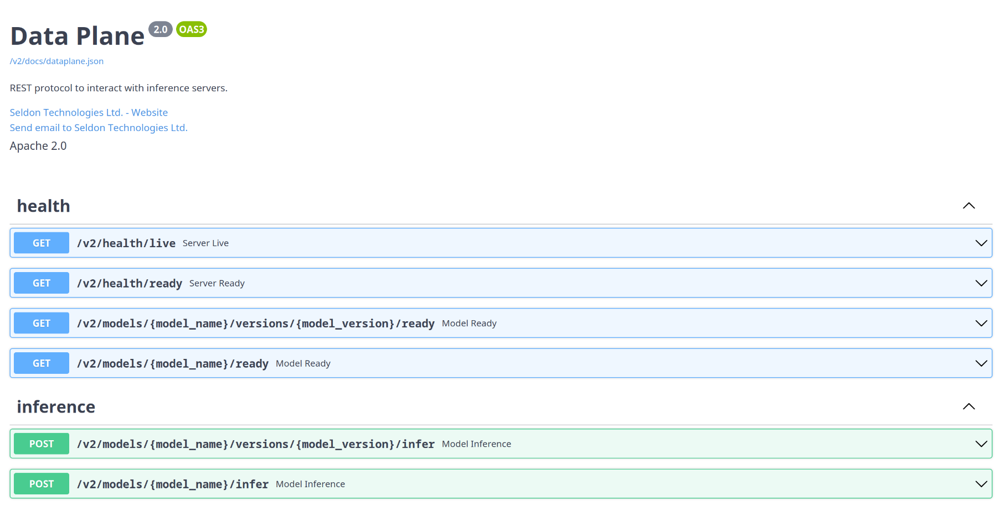
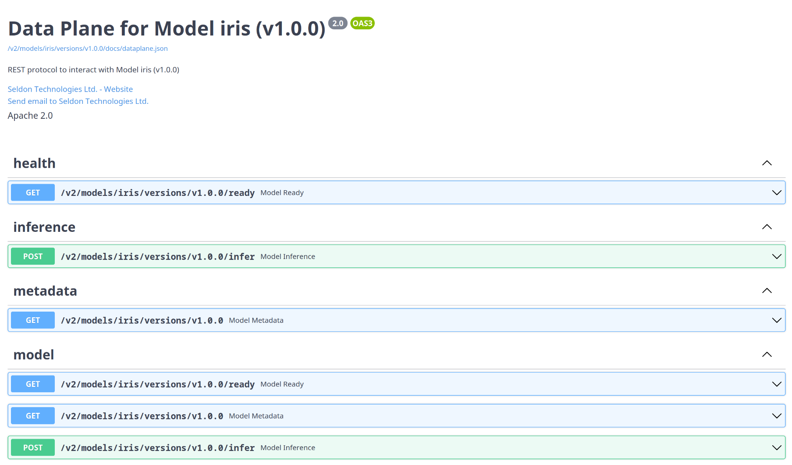

<!--
# OpenAPI Support

MLServer follows the Open Inference Protocol (previously known as the "V2
Protocol").
You can find the full OpenAPI spec for the Open Inference Protocol in the links
below:

| Name                       | Description                                                                                          | OpenAPI Spec                                                            |
| -------------------------- | ---------------------------------------------------------------------------------------------------- | ----------------------------------------------------------------------- |
| Open Inference Protocol    | Main dataplane for inference, health and metadata                                                    | {download}`dataplane.json <../../openapi/dataplane.json>`               |
| Model Repository Extension | Extension to the protocol to provide a control plane which lets you load / unload models dynamically | {download}`model_repository.json <../../openapi/model_repository.json>` |
-->

# OpenAPI サポート

MLServer は Open Inference Protocol（以前は「V2プロトコル」として知られていました）に従います。
Open Inference Protocol の完全な OpenAPI スペックは、以下のリンクで確認できます：

| 名前                       | 説明                                                                                              | OpenAPI スペック                                                       |
| -------------------------- | ------------------------------------------------------------------------------------------------ | ---------------------------------------------------------------------- |
| Open Inference Protocol    | 推論、健康状態、メタデータのためのメインデータプレーン                                            | {download}`dataplane.json <../../openapi/dataplane.json>`              |
| Model Repository Extension | モデルを動的にロード/アンロードするためのコントロールプレーンを提供するプロトコルの拡張             | {download}`model_repository.json <../../openapi/model_repository.json>`|


<!--
## Swagger UI

On top of the OpenAPI spec above, MLServer also autogenerates a Swagger UI
which can be used to interact dynamycally with the Open Inference Protocol.

The autogenerated Swagger UI can be accessed under the `/v2/docs` endpoint.

```{note}
Besides the Swagger UI, you can also access the _raw_ OpenAPI spec through the
`/v2/docs/dataplane.json` endpoint.
```


-->

## Swagger UI

上記の OpenAPI スペックに加えて、MLServer は Swagger UI を自動生成し、Open Inference Protocol と対話的にやり取りすることができます。

自動生成された Swagger UI は `/v2/docs` エンドポイントでアクセスできます。

Swagger UI に加えて、`/v2/docs/dataplane.json` エンドポイントを通じて _raw_ OpenAPI スペックにもアクセスできます。


<!--
## Model Swagger UI

Alongside the [general API documentation](#Swagger-UI), MLServer will also
autogenerate a Swagger UI tailored to individual models, showing the endpoints
available for each one.

The model-specific autogenerated Swagger UI can be accessed under the following
endpoints:

- `/v2/models/{model_name}/docs`
- `/v2/models/{model_name}/versions/{model_version}/docs`

```{note}
Besides the Swagger UI, you can also access the model-specific _raw_ OpenAPI spec through
the following endpoints:

- `/v2/models/{model_name}/docs/dataplane.json`
- `/v2/models/{model_name}/versions/{model_version}/docs/dataplane.json`
```


-->

## モデル Swagger UI

[一般的な API ドキュメント](#Swagger-UI)に加えて、MLServer は各モデルに対して特定のエンドポイントを示す Swagger UI を自動生成します。

モデル固有の自動生成された Swagger UI は以下のエンドポイントでアクセスできます：

- `/v2/models/{model_name}/docs`
- `/v2/models/{model_name}/versions/{model_version}/docs`

Swagger UI に加えて、以下のエンドポイントを通じてモデル固有の _raw_ OpenAPI スペックにもアクセスできます：

- `/v2/models/{model_name}/docs/dataplane.json`
- `/v2/models/{model_name}/versions/{model_version}/docs/dataplane.json`


