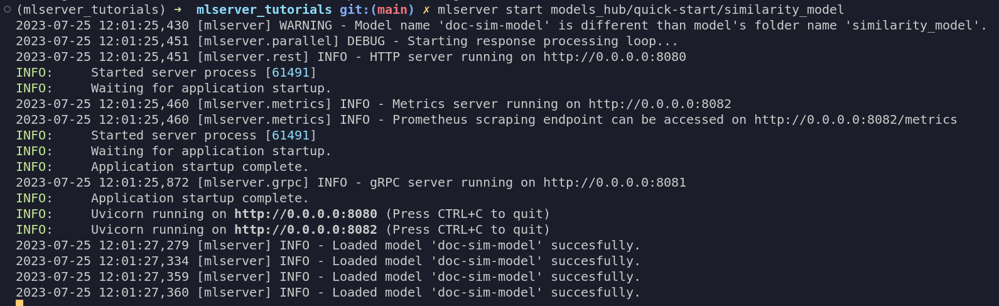
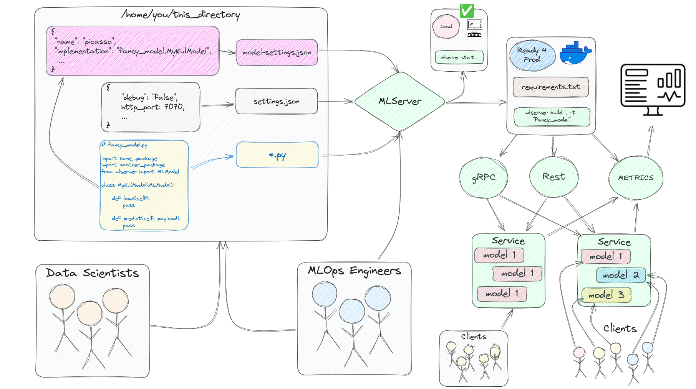

<!--
# Getting Started with MLServer

This guide will help you get started creating machine learning microservices with MLServer 
in less than 30 minutes. Our use case will be to create a service that helps us compare the similarity 
between two documents. Think about whenever you are comparing a book, news article, blog post, 
or tutorial to read next, wouldn't it be great to have a way to compare with 
similar ones that you have already read and liked (without having to rely on a recommendation's system)? 
That's what we'll focus on this guide, on creating a document similarity service. 📜 + 📃 = 😎👌🔥

The code is showcased as if it were cells inside a notebook but you can run each of the steps 
inside Python files with minimal effort.
-->
# MLServerを使って機械学習マイクロサービスを始める

このガイドは、MLServerを使用して機械学習マイクロサービスを作成する方法を30分以内に学ぶためのものです。私たちのユースケースは、2つのドキュメントの類似性を比較するサービスを作成することです。本、ニュース記事、ブログ投稿、または次に読むチュートリアルを比較する際に、すでに読んで気に入ったものと比較する方法があれば素晴らしいと思いませんか（レコメンデーションシステムに頼ることなく）？このガイドでは、ドキュメントの類似性サービスの作成に焦点を当てます。📜 + 📃 = 😎👌🔥

コードはノートブック内のセルのように見せかけていますが、Pythonファイル内でこれらのステップを最小の努力で実行することができます。


<!--
## 00 What is MLServer?

MLServer is an open-source Python library for building production-ready asynchronous APIs for machine learning models.
-->

## 00 MLServerとは？

MLServerは、機械学習モデルのための本番環境向けの非同期APIを構築するためのオープンソースのPythonライブラリです。

<!--
## 01 Dependencies

The first step is to install `mlserver`, the `spacy` library, and the [language model](https://spacy.io/models/en#en_core_web_lg) 
`spacy` will need for our use case. We will also download the `wikipedia-api` library to 
test our use case with a few fun summaries.

If you've never heard of [spaCy](https://spacy.io/) before, it is an open-source Python 
library for advanced natural language processing that excels at large-scale information 
extraction and retrieval tasks, among many others. The model we'll use is a pre-trained 
model on English text from the web. This model will help us get started with our use case 
faster than if we had to train a model from scratch for our use case.

Let's first install these libraries.
-->

## 01 依存関係

最初のステップは、`mlserver`、`spacy`ライブラリ、および私たちのユースケースに必要な[言語モデル](https://spacy.io/models/en#en_core_web_lg) `spacy`をインストールすることです。また、いくつかの楽しい要約で私たちのユースケースをテストするために`wikipedia-api`ライブラリもダウンロードします。

もし[spaCy](https://spacy.io/)を聞いたことがなければ、それは大規模な情報抽出や検索タスクなどに優れた、高度な自然言語処理を行うオープンソースのPythonライブラリです。ここで使用するモデルは、ウェブ上の英語テキストから事前に訓練されたモデルです。このモデルは、私たちのユースケースをゼロからモデルを訓練するよりも迅速に始めるのに役立ちます。

まず、これらのライブラリをインストールしましょう。


```python
pip install mlserver spacy wikipedia-api
```

<!--
We will also need to download the language model separately once we have spaCy inside our virtual environment.
-->
また、仮想環境内にspaCyをインストールした後、言語モデルを別途ダウンロードする必要があります。


```python
python -m spacy download en_core_web_lg
```

<!--
If you're going over this guide inside a notebook, don't forget to add an exclamation mark `!` 
in front of the two commands above. If you are in VSCode, you can keep them as they are and 
change the cell type to bash.
-->

このガイドをノートブック内で確認している場合、上記の2つのコマンドの前に感嘆符`!`を忘れずに追加してください。VSCodeを使用している場合は、そのままにしてセルのタイプをbashに変更できます。

<!--
## 02 Set Up


At its core, MLServer requires that users give it 3 things, a `model-settings.json` file with 
information about the model, an (optional) `settings.json` file with information related to the server you 
are about to set up, and a `.py` file with the load-predict recipe for your model (as shown in the 
picture above).

Let's create a directory for our model.
-->

## 02 設定


MLServerを使用するためには、基本的に3つのものが必要です。モデルに関する情報が記載された`model-settings.json`ファイル、設定するサーバーに関連する情報を含む（オプションの）`settings.json`ファイル、そしてモデルのロードと予測のレシピを記述した`.py`ファイルです（上の画像に示されています）。

モデルのディレクトリを作成しましょう。


```python
mkdir -p similarity_model
```

<!--
Before we create a service that allows us to compare the similarity between two documents, it is 
good practice to first test that our solution works first, especially if we're using a pre-trained 
model and/or a pipeline.
-->
2つのドキュメント間の類似性を比較するサービスを作成する前に、特に事前に訓練されたモデルやパイプラインを使用している場合、最初に私たちのソリューションが機能するかどうかをテストすることが良い習慣です。


```python
import spacy
```


```python
nlp = spacy.load("en_core_web_lg")
```

<!--
Now that we have our model loaded, let's look at the similarity of the abstracts of 
[Barbieheimer](https://en.wikipedia.org/wiki/Barbenheimer) using the `wikipedia-api` 
Python library. The main requirement of the API is that we pass into the main class, 
`Wikipedia()`, a project name, an email and the language we want information to be 
returned in. After that, we can search the for the movie summaries we want by passing 
the title of the movie to the `.page()` method and accessing the summary of it with 
the `.summary` attribute.

Feel free to change the movies for other topics you might be interested in.

You can run the following lines inside a notebook or, conversely, add them to a `app.py` file.
-->

モデルをロードしたら、`wikipedia-api` Pythonライブラリを使用して、[Barbieheimer](https://en.wikipedia.org/wiki/Barbenheimer)の要約の類似性を調べます。このAPIを使用するための主要な要件は、`Wikipedia()`クラスにプロジェクト名、メールアドレス、および情報を取得したい言語を渡すことです。その後、`.page()`メソッドに映画のタイトルを渡して、その要約にアクセスできます。

他の興味深いトピックについても構いません。

以下のコードをノートブック内で実行するか、`app.py`ファイルに追加してください。


```python
import wikipediaapi
```

```python
wiki_wiki = wikipediaapi.Wikipedia('MyMovieEval (example@example.com)', 'en')
```

```python
barbie = wiki_wiki.page('Barbie_(film)').summary
oppenheimer = wiki_wiki.page('Oppenheimer_(film)').summary

print(barbie)
print()
print(oppenheimer)
```

<!--
If you created an `app.py` file with the code above, make sure you run `python app.py` from 
the terminal.
-->

上記のコードで`app.py`ファイルを作成した場合、ターミナルから`python app.py`を実行してください。


```
Barbie is a 2023 American fantasy comedy film directed by Greta Gerwig and written by Gerwig and Noah Baumbach. Based on the Barbie fashion dolls by Mattel, it is the first live-action Barbie film after numerous computer-animated direct-to-video and streaming television films. The film stars Margot Robbie as Barbie and Ryan Gosling as Ken, and follows the two on a journey of self-discovery following an existential crisis. The film also features an ensemble cast that includes America Ferrera, Kate McKinnon, Issa Rae, Rhea Perlman, and Will Ferrell...

Oppenheimer is a 2023 biographical thriller film written and directed by Christopher Nolan. Based on the 2005 biography American Prometheus by Kai Bird and Martin J. Sherwin, the film chronicles the life of J. Robert Oppenheimer, a theoretical physicist who was pivotal in developing the first nuclear weapons as part of the Manhattan Project, and thereby ushering in the Atomic Age. Cillian Murphy stars as Oppenheimer, with Emily Blunt as Oppenheimer's wife Katherine "Kitty" Oppenheimer; Matt Damon as General Leslie Groves, director of the Manhattan Project; and Robert Downey Jr. as Lewis Strauss, a senior member of the United States Atomic Energy Commission. The ensemble supporting cast includes Florence Pugh, Josh Hartnett, Casey Affleck, Rami Malek, Gary Oldman and Kenneth Branagh...
```

<!--
Now that we have our two summaries, let's compare them using spacy.
-->

これで2つの要約が手に入りましたので、spacyを使用してそれらを比較しましょう。

```python
doc1 = nlp(barbie)
doc2 = nlp(oppenheimer)
```


```python
doc1.similarity(doc2)
```


    0.9866910567224084


<!--
Notice that both summaries have information about the other movie, about "films" in general, 
and about the dates each aired on (which is the same). The reality is that, the model hasn't seen 
any of these movies so it might be generalizing to the context of each article, "movies," 
rather than their content, "dolls as humans and the atomic bomb."

You should, of course, play around with different pages and see if what you get back is coherent with 
what you would expect.

Time to create a machine learning API for our use-case. 😎
-->

両方の要約には、もう一つの映画に関する情報、一般的な「映画」についての情報、そしてそれぞれが放映された日付（同じ日付です）についての情報が含まれています。現実は、モデルはこれらの映画を見たことがないため、各記事のコンテキスト「映画」に一般化している可能性がありますが、その内容「人形としての人間と原子爆弾」ではないかもしれません。

もちろん、異なるページで遊んでみて、返ってくる結果があなたの期待と一致しているかどうかを確認してください。

私たちのユースケースのための機械学習APIを作成する時が来ました。😎


<!--
## 03 Building a Service

MLServer allows us to wrap machine learning models into APIs and build microservices with 
replicas of a single model, or different models all together.

To create a service with MLServer, we will define a class with two asynchronous functions, one that 
loads the model and another one to run inference (or predict) with. The former will load the 
`spacy` model we tested in the last section, and the latter will take in a list with the two 
documents we want to compare. Lastly, our function will return a `numpy` array with a single 
value, our similarity score. We'll write the file to our `similarity_model` directory and call 
it `my_model.py`. 
-->


## 03 サービスの構築

MLServerを使用すると、機械学習モデルをAPIにラップしてマイクロサービスを構築し、単一のモデルのレプリカや異なるモデルを組み合わせることができます。

MLServerでサービスを作成するために、モデルをロードする非同期関数と推論（または予測）を実行するもう一つの非同期関数を持つクラスを定義します。前者は前のセクションでテストした`spacy`モデルをロードし、後者は比較したい2つのドキュメントのリストを受け取ります。最後に、この関数は類似度スコアとして単一の値を持つ`numpy`配列を返します。このファイルを`similarity_model`ディレクトリに書き込み、`my_model.py`と呼びます。


```python
# similarity_model/my_model.py

from mlserver.codecs import decode_args
from mlserver import MLModel
from typing import List
import numpy as np
import spacy

class MyKulModel(MLModel):

    async def load(self):
        self.model = spacy.load("en_core_web_lg")
    
    @decode_args
    async def predict(self, docs: List[str]) -> np.ndarray:

        doc1 = self.model(docs[0])
        doc2 = self.model(docs[1])

        return np.array(doc1.similarity(doc2))
```

<!--
Now that we have our model file ready to go, the last piece of the puzzle is to tell MLServer a bit of info 
about it. In particular, it wants (or needs) to know the name of the model and how to implement 
it. The former can be anything you want (and it will be part of the URL of your API), and the latter will 
follow the recipe of `name_of_py_file_with_your_model.class_with_your_model`.

Let's create the `model-settings.json` file MLServer is expecting inside our `similarity_model` directory 
and add the name and the implementation of our model to it.
-->

モデルファイルの準備が整ったので、残りのピースはMLServerにモデルについて少し情報を教えることです。特に、モデルの名前と実装方法を知りたがっています。前者はあなたが望むもので何でもよく（APIのURLの一部になります）、後者は`name_of_py_file_with_your_model.class_with_your_model`のレシピに従います。

`similarity_model`ディレクトリ内にMLServerが期待する`model-settings.json`ファイルを作成し、そこにモデルの名前と実装を追加しましょう。


```json
# similarity_model/model-settings.json

{
    "name": "doc-sim-model",
    "implementation": "my_model.MyKulModel"
}
```

<!--
Now that everything is in place, we can start serving predictions locally to test how things would play 
out for our future users. We'll initiate our server via the command line, and later on we'll see how to 
do the same via Python files. Here's where we are at right now in the process of developing microservices 
with MLServer.


As you can see in the image, our server will be initialized with three entry points, one for HTTP requests, 
another for gRPC, and another for the metrics. To learn more about the powerful metrics feature of MLServer, 
please visit the relevant docs page [here](https://mlserver.readthedocs.io/en/latest/user-guide/metrics.html). 
To learn more about gRPC, please see this tutorial [here](https://realpython.com/python-microservices-grpc/).

To start our service, open up a terminal and run the following command.
-->

全てが整いましたので、将来のユーザーにとってどのような結果が出るかをテストするために、ローカルで予測を提供し始めることができます。サーバーはコマンドラインを通じて初期化され、後にPythonファイルを使用して同様のことを行う方法を見ていきます。現在、MLServerを使用したマイクロサービスの開発プロセスは以下のところまで進んでいます。


画像で見ることができるように、私たちのサーバーはHTTPリクエスト用、gRPC用、およびメトリクス用の3つのエントリポイントで初期化されます。MLServerの強力なメトリクス機能について詳しく知りたい場合は、関連するドキュメントページ[こちら](https://mlserver.readthedocs.io/en/latest/user-guide/metrics.html)をご覧ください。gRPCについて詳しく知るには、このチュートリアル[こちら](https://realpython.com/python-microservices-grpc/)をご覧ください。

サービスを開始するには、ターミナルを開いて次のコマンドを実行してください。


```bash
mlserver start similarity_model/
```

<!--
Note: If this is a fresh terminal, make sure you activate your environment before you run the command above. 
If you run the command above from your notebook (e.g. `!mlserver start similarity_model/`), 
you will have to send the request below from another notebook or terminal since the cell will continue to run 
until you turn it off.
-->


注意：新しいターミナルを使用する場合は、上記のコマンドを実行する前に環境をアクティブにしてください。
ノートブックから上記のコマンドを実行する場合（例：`!mlserver start similarity_model/`）、セルがオフになるまで実行が続くため、リクエストは別のノートブックまたはターミナルから送信する必要があります。

<!--
## 04 Testing our Service

Time to become a client of our service and test it. For this, we'll set up the payload we'll send 
to our service and use the `requests` library to [POST](https://www.baeldung.com/cs/http-get-vs-post) our request.
-->

## 04 サービスのテスト

私たちのサービスのクライアントになり、テストを行う時が来ました。これのために、サービスに送るペイロードを設定し、`requests`ライブラリを使用してリクエストを[POST](https://www.baeldung.com/cs/http-get-vs-post)します。

```python
from mlserver.codecs import StringCodec
import requests
```

<!--
Please note that the request below uses the variables we created earlier with the summaries 
of Barbie and Oppenheimer. If you are sending this POST request from a fresh python file, make 
sure you move those lines of code above into your request file.
-->
以下のリクエストは、以前に作成したBarbieとOppenheimerの要約で使用した変数を使用しています。新しいPythonファイルからこのPOSTリクエストを送信する場合は、上記のコード行をリクエストファイルに移動することを確認してください。


```python
inference_request = {
    "inputs": [
        StringCodec.encode_input(name='docs', payload=[barbie, oppenheimer], use_bytes=False).dict()
    ]
}
print(inference_request)
```


    {'inputs': [{'name': 'docs',
       'shape': [2, 1],
       'datatype': 'BYTES',
       'parameters': {'content_type': 'str'},
       'data': [
            'Barbie is a 2023 American fantasy comedy...',
            'Oppenheimer is a 2023 biographical thriller...'
            ]
        }]
    }


```python
r = requests.post('http://0.0.0.0:8080/v2/models/doc-sim-model/infer', json=inference_request)
```


```python
r.json()
```

```
{'model_name': 'doc-sim-model',
    'id': 'a4665ddb-1868-4523-bd00-a25902d9b124',
    'parameters': {},
    'outputs': [{'name': 'output-0',
    'shape': [1],
    'datatype': 'FP64',
    'parameters': {'content_type': 'np'},
    'data': [0.9866910567224084]}]}
```


```python
print(f"Our movies are {round(r.json()['outputs'][0]['data'][0] * 100, 4)}% similar!")
```

```
Our movies are 98.6691% similar
```

<!--
Let's decompose what just happened.

The `URL` for our service might seem a bit odd if you've never heard of the 
[V2/Open Inference Protocol (OIP)](https://docs.seldon.io/projects/seldon-core/en/latest/reference/apis/v2-protocol.html). 
This protocol is a set of specifications that allows machine learning models to be shared and deployed in a 
standardized way. This protocol enables the use of machine learning models on a variety of platforms and 
devices without requiring changes to the model or its code. The OIP is useful because it allows us
to integrate machine learning into a wide range of applications in a standard way.

All URLs you create with MLServer will have the following structure.


This kind of protocol is a standard adopted by different companies like NVIDIA, Tensorflow Serving, 
KServe, and others, to keep everyone on the same page. If you think about driving cars globally, 
your country has to apply a standard for driving on a particular side of the road, and this ensures 
you and everyone else stays on the left (or the right depending on where you are at). Adopting this 
means that you won't have to wonder where the next driver is going to come out of when you are driving 
and are about to take a turn, instead, you can focus on getting to where you're going to without much worrying.

Let's describe what each of the components of our `inference_request` does.
- `name`: this maps one-to-one to the name of the parameter in your `predict()` function.
- `shape`: represents the shape of the elements in our `data`. In our case, it is a list with `[2]` strings.
- `datatype`: the different data types expected by the server, e.g., str, numpy array, pandas dataframe, bytes, etc.
- `parameters`: allows us to specify the `content_type` beyond the data types 
- `data`: the inputs to our predict function.

To learn more about the OIP and how MLServer content types work, please have a looks at their 
[docs page here](https://mlserver.readthedocs.io/en/latest/user-guide/content-type.html).
-->
起こったことを詳しく解析しましょう。

私たちのサービスの`URL`は、[V2/Open Inference Protocol (OIP)](https://docs.seldon.io/projects/seldon-core/en/latest/reference/apis/v2-protocol.html)について聞いたことがなければ少し奇妙に見えるかもしれません。このプロトコルは、機械学習モデルを標準化された方法で共有およびデプロイすることを可能にする仕様のセットです。このプロトコルにより、モデルやそのコードを変更することなく、さまざまなプラットフォームやデバイスで機械学習モデルを使用できます。OIPは標準的な方法で多岐にわたるアプリケーションに機械学習を統合することを可能にします。

MLServerで作成するすべてのURLは、次の構造を持ちます。


この種のプロトコルは、NVIDIA、Tensorflow Serving、KServeなどの異なる企業によって採用されており、すべての人が同じ基準に沿って動くことを保証します。車の運転について考えると、あなたの国は特定の道路の側を走行するための標準を適用する必要があり、これによりあなたと他のすべての人が左（またはあなたがいる場所によっては右）に留まることを保証します。これを採用することで、運転中に次にどのドライバーが出てくるかを心配することなく、目的地に向かうことに集中できるようになります。

私たちの`inference_request`の各コンポーネントが何をするかを説明しましょう。
- `name`: これはあなたの`predict()`関数のパラメータ名と一対一で対応します。
- `shape`: 私たちの`data`の要素の形を表します。私たちの場合、これは`[2]`個の文字列を持つリストです。
- `datatype`: サーバーが期待する異なるデータタイプを表します。例えば、str、numpy配列、pandasデータフレーム、バイトなど。
- `parameters`: データタイプを超えて`content_type`を指定することができます。
- `data`: 私たちの予測関数への入力です。

OIPとMLServerのコンテントタイプの動作について詳しく知るには、[こちらのドキュメントページ](https://mlserver.readthedocs.io/en/latest/user-guide/content-type.html)をご覧ください。


<!--
## 05 Creating Model Replicas

Say you need to meet the demand of a high number of users and one model might not be enough, or is not using 
all of the resources of the virtual machine instance it was allocated to. What we can do in this case is 
to create multiple replicas of our model to increase the throughput of the requests that come in. This 
can be particularly useful at the peak times of our server. To do this, we need to tweak the settings of 
our server via the `settings.json` file. In it, we'll add the number of independent models we want to 
have to the parameter `"parallel_workers": 3`.

Let's stop our server, change the settings of it, start it again, and test it.
-->
## 05 モデルレプリカの作成

多くのユーザーの需要に応えるために、1つのモデルだけでは不十分である場合や、割り当てられた仮想マシンインスタンスのリソースをすべて使用していない場合があります。この場合にできることは、モデルの複数のレプリカを作成して、入ってくるリクエストのスループットを増加させることです。これは、サーバーのピーク時に特に役立ちます。これを行うためには、`settings.json`ファイルを介してサーバーの設定を調整する必要があります。このファイルで、独立したモデルの数をパラメータ`"parallel_workers": 3`に追加します。

サーバーを停止し、その設定を変更して再び起動し、テストしてみましょう。


```json
# similarity_model/settings.json

{
    "parallel_workers": 3
}
```


```bash
mlserver start similarity_model
```

<!--


As you can see in the output of the terminal in the picture above, we now have 3 models running in 
parallel. The reason you might see 4 is because, by default, MLServer will print the name of the 
initialized model if it is one or more, and it will also print one for each of the replicas 
specified in the settings.

Let's get a few more [twin films examples](https://en.wikipedia.org/wiki/Twin_films) to test our 
server. Get as creative as you'd like. 💡
-->


上の画像のターミナルの出力で見ることができるように、現在3つのモデルが並行して動作しています。4つ見えるかもしれませんが、これはデフォルトでMLServerが1つ以上の初期化されたモデルの名前を出力し、設定で指定された各レプリカについても出力するためです。

サーバーをテストするために、もっと多くの[ツインフィルムの例](https://en.wikipedia.org/wiki/Twin_films)を使ってみましょう。好きなだけ創造的になってください。💡


```python
deep_impact    = wiki_wiki.page('Deep_Impact_(film)').summary
armageddon     = wiki_wiki.page('Armageddon_(1998_film)').summary

antz           = wiki_wiki.page('Antz').summary
a_bugs_life    = wiki_wiki.page("A_Bug's_Life").summary

the_dark_night = wiki_wiki.page('The_Dark_Knight').summary
mamma_mia      = wiki_wiki.page('Mamma_Mia!_(film)').summary
```


```python
def get_sim_score(movie1, movie2):
    response = requests.post(
        'http://0.0.0.0:8080/v2/models/doc-sim-model/infer', 
        json={
            "inputs": [
                StringCodec.encode_input(name='docs', payload=[movie1, movie2], use_bytes=False).dict()
            ]
        })
    return response.json()['outputs'][0]['data'][0]
```

<!--
Let's first test that the function works as intended.
-->
まずは、関数が意図したとおりに機能するかをテストしましょう。

```python
get_sim_score(deep_impact, armageddon)
```


    0.9569279450151813


<!--
Now let's map three POST requests at the same time.
-->
次に、同時に3つのPOSTリクエストをマッピングしましょう。

```python
results = list(
    map(get_sim_score, (deep_impact, antz, the_dark_night), (armageddon, a_bugs_life, mamma_mia))
)
results
```


    [0.9569279450151813, 0.9725374771538605, 0.9626173937217876]


<!--
We can also test it one by one.
-->
また、一つずつテストすることもできます。


```python
for movie1, movie2 in zip((deep_impact, antz, the_dark_night), (armageddon, a_bugs_life, mamma_mia)):
    print(get_sim_score(movie1, movie2))
```

    0.9569279450151813
    0.9725374771538605
    0.9626173937217876


<!--
## 06 Packaging our Service



For the last step of this guide, we are going to package our model and service into a 
docker image that we can reuse in another project or share with colleagues immediately. This step 
requires that we have docker installed and configured in our PCs, so if you need to set up docker, 
you can do so by following the instructions in the documentation [here](https://docs.docker.com/get-docker/).

The first step is to create a `requirements.txt` file with all of our dependencies and add it to 
the directory we've been using for our service (`similarity_model`).
-->
## 06 サービスのパッケージ化


このガイドの最後のステップでは、モデルとサービスをDockerイメージにパッケージ化し、別のプロジェクトで再利用したり、すぐに同僚と共有したりできるようにします。このステップでは、PCにDockerがインストールされて設定されている必要があるため、Dockerの設定が必要な場合は、[ここ](https://docs.docker.com/get-docker/)のドキュメントの指示に従って設定できます。

最初のステップは、すべての依存関係を含む`requirements.txt`ファイルを作成し、サービスに使用しているディレクトリ（`similarity_model`）に追加することです。


```python
# similarity_model/requirements.txt

mlserver
spacy==3.6.0
https://github.com/explosion/spacy-models/releases/download/en_core_web_lg-3.6.0/en_core_web_lg-3.6.0-py3-none-any.whl
```

<!--
The next step is to build a docker image with our model, its dependencies and our server. If you've never heard 
of **docker images** before, here's a short description.

> A Docker image is a lightweight, standalone, and executable package that includes everything needed to run a piece of software, including code, libraries, dependencies, and settings. It's like a carry-on bag for your application, containing everything it needs to travel safely and run smoothly in different environments. Just as a carry-on bag allows you to bring your essentials with you on a trip, a Docker image enables you to transport your application and its requirements across various computing environments, ensuring consistent and reliable deployment.

MLServer has a convenient function that lets us create docker images with our services. Let's use it.
-->
次のステップは、モデル、その依存関係、およびサーバーを含むDockerイメージを構築することです。もし**Dockerイメージ**について聞いたことがなければ、こちらが簡単な説明です。

> Dockerイメージは、軽量で独立しており、実行可能なパッケージで、ソフトウェアを実行するために必要なすべてを含んでいます。これには、コード、ライブラリ、依存関係、設定が含まれます。それはあなたのアプリケーションのための機内持ち込み荷物のようなもので、異なる環境で安全に移動し、スムーズに実行するために必要なすべてを含んでいます。機内持ち込み荷物が旅行に必要なものを持っていくことを可能にするように、Dockerイメージはあなたのアプリケーションとその要件をさまざまなコンピューティング環境に輸送し、一貫した信頼性のあるデプロイメントを保証します。

MLServerには、サービスを含むDockerイメージを作成する便利な機能があります。それを使用しましょう。

```python
mlserver build similarity_model/ -t 'fancy_ml_service'
```

<!--
We can check that our image was successfully build not only by looking at the logs of the previous 
command but also with the `docker images` command.
-->
前のコマンドのログを見るだけでなく、`docker images`コマンドを使って、私たちのイメージが正常に構築されたかを確認することができます。

```bash
docker images
```

<!--
Let's test that our image works as intended with the following command. Make sure you have closed your 
previous server by using `CTRL + C` in your terminal.
-->
以下のコマンドを使用して、私たちのイメージが意図した通りに機能するかをテストしましょう。ターミナルで`CTRL + C`を使用して、前のサーバーを閉じていることを確認してください。


```bash
docker run -it --rm -p 8080:8080 fancy_ml_service
```

<!--
Now that you have a packaged and fully-functioning microservice with our model, we could deploy our container 
to a production serving platform like [Seldon Core](https://docs.seldon.io/projects/seldon-core/en/latest/#), 
or via different offerings available through the many cloud providers out there (e.g. AWS Lambda, Google 
Cloud Run, etc.). You could also run this image on KServe, a Kubernetes native tool for model serving, or 
anywhere else where you can bring your docker image with you.

To learn more about MLServer and the different ways in which you can use it, head over to the 
[examples](https://mlserver.readthedocs.io/en/latest/examples/index.html) section 
or the [user guide](https://mlserver.readthedocs.io/en/latest/user-guide/index.html). To learn about 
some of the deployment options available, head over to the docs [here](https://mlserver.readthedocs.io/en/stable/user-guide/deployment/index.html).

To keep up to date with what we are up to at Seldon, make sure you join our 
[Slack community](https://join.slack.com/t/seldondev/shared_invite/zt-vejg6ttd-ksZiQs3O_HOtPQsen_labg).
-->
これで、モデルを含むパッケージ化された完全に機能するマイクロサービスが用意されましたので、[Seldon Core](https://docs.seldon.io/projects/seldon-core/en/latest/#)のような本番環境用のプラットフォームにコンテナをデプロイすることができます。または、AWS Lambda、Google Cloud Runなど、多くのクラウドプロバイダーが提供するさまざまなオプションを通じてデプロイすることもできます。このイメージをKServe（モデル提供のためのKubernetesネイティブツール）や、ドッカーイメージを持ち込める他の場所で実行することも可能です。

MLServerおよびその使用方法についてさらに学ぶには、[examples](https://mlserver.readthedocs.io/en/latest/examples/index.html)セクションや[user guide](https://mlserver.readthedocs.io/en/latest/user-guide/index.html)をご覧ください。利用可能なデプロイメントオプションについて学ぶには、[こちらのドキュメント](https://mlserver.readthedocs.io/en/stable/user-guide/deployment/index.html)をご覧ください。

Seldonで行っていることに最新の情報を得るためには、私たちの[Slack community](https://join.slack.com/t/seldondev/shared_invite/zt-vejg6ttd-ksZiQs3O_HOtPQsen_labg)にぜひ参加してください。

